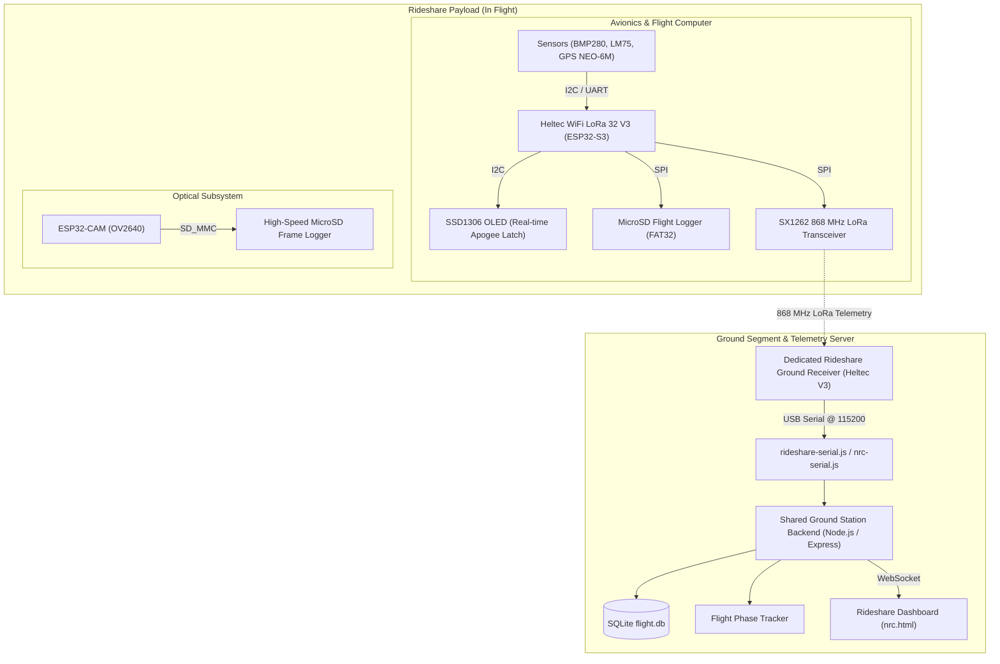

# Rideshare Payload

## Overview

The Rideshare Payload is an autonomous secondary avionics and imaging system designed for integration into sounding rocket airframes. It provides in-flight atmospheric profiling, trajectory monitoring, onboard visual recording, local apogee latching, and real-time long-range RF telemetry transmission to a dedicated ground receiver.

This directory contains the complete flight computer firmware, autonomous camera module software, dedicated LoRa ground station receiver, telemetry parsers, bench testing suites, flight datasets, and engineering documentation for the Rideshare Payload system.

---

## System Architecture

The Rideshare Payload architecture integrates multi-frequency sensing, independent camera recording, and long-range LoRa ground communications:



---

## Flight Computer

* **Microcontroller & Radio:** Heltec WiFi LoRa 32 V3 featuring an ESP32-S3FN8 dual-core Xtensa LX7 processor (240 MHz, 8 MB Flash, 512 KB SRAM) with an integrated Semtech SX1262 LoRa transceiver.
* **Onboard Display:** 0.96-inch 128×64 monochrome I2C OLED display (SSD1306) driven by `U8g2` (`SDA: GPIO 17`, `SCL: GPIO 18`, `RST: GPIO 21`), used to display live sensor health on the pad and latch max altitude/apogee post-flight without requiring a ground station connection.
* **Sensor Array & Bus Interfacing:**
  * **Barometric Pressure & Altitude:** Bosch Sensortec BMP280 on I2C (`0x76`, `SDA: GPIO 1`, `SCL: GPIO 2`).
  * **Digital Temperature:** LM75 on I2C (`0x48`, `SDA: GPIO 1`, `SCL: GPIO 2`).
  * **GPS Receiver:** U-Blox NEO-6M GPS module on hardware UART (`Serial1`, `RX: GPIO 7`, `TX: GPIO 6` @ 9600 baud) driven by `TinyGPSPlus`.
* **Onboard Storage:** SPI MicroSD card module (`CS: GPIO 38`, `SCK: GPIO 39`, `MOSI: GPIO 41`, `MISO: GPIO 42`) writing CSV flight records.
* **Firmware Targets:** Located in [`Rideshare_Payload/Firmware/Flight_Computer/`](Firmware/Flight_Computer/):
  * `src/main.cpp` — Complete flight software with sensor acquisition, OLED state display, SD logging, and LoRa broadcast.
  * `src/sd_card_test.cpp` — Diagnostic firmware for verifying SPI SD bus integrity and throughput.
  * `src/gps_uart_test.cpp` — Diagnostic firmware for validating UART NMEA sentence acquisition and satellite lock.

---

## Camera Module

The Rideshare Payload features an independent autonomous optical subsystem located in [`Rideshare_Payload/Firmware/Camera_Module/`](Firmware/Camera_Module/):

* **Hardware:** AI-Thinker ESP32-CAM board with an Omnivision OV2640 2-megapixel image sensor.
* **Operation:** Automatically initializes the camera sensor and SD_MMC interface upon power-up, creates indexed flight directories (`/flight_logs/`), and continuously streams compressed JPEG frames to the onboard SD card.
* **Fail-Safe Operation:** Designed to operate independently from the primary flight computer to prevent imaging bottlenecks from affecting mission-critical telemetry. Video/still frames are recovered post-flight from the camera SD card.

---

## Ground Station

The Rideshare Payload uses a dedicated ground receiver located in [`Rideshare_Payload/Firmware/Ground_Station/`](Firmware/Ground_Station/):

* **Embedded Hardware:** Heltec WiFi LoRa 32 V3 configured with matching 868 MHz RF parameters.
* **Firmware Operation:** Operates the SX1262 in continuous receive mode (`RadioLib`), verifies packet integrity, prints RSSI and SNR metrics, and forwards ASCII telemetry frames over USB Serial at 115200 baud.
* **Ingest Driver (`rideshare-serial.js` / `nrc-serial.js`):** Serial stream interface that parses incoming lines, validates the `$NRC` / `MXR3:` prefix, verifies the trailing XOR checksum, and inserts packets into the shared ground database.

---

## Telemetry Protocol

### LoRa Radio Parameters
* **Frequency:** 868.0 MHz (European/UK ISM Band)
* **Bandwidth:** 125.0 kHz
* **Spreading Factor:** SF7
* **Coding Rate:** 4/5
* **Sync Word:** `0x12`
* **Output Power:** +14 dBm

### ASCII Telemetry Format (`$NRC` Frame)
Live telemetry frames are transmitted as comma-separated ASCII strings terminated with an asterisk and an 8-bit XOR hexadecimal checksum:

```text
$NRC,<packet_id>,<timestamp_ms>,<state>,<pressure_pa>,<bmp_temp_c>,<lm75_temp_c>,<gps_lat>,<gps_lon>,<gps_alt_m>,<gps_sats>,<sd_status>,<cam_status>*<XOR_HEX>
```

The payload also accepts compatibility frames (`MXR3:`) structured for legacy bench decoders:
```text
MXR3:<packet_id>,<timestamp_ms>,<altitude_m>,<temp_c>,<lm75_temp_c>,<pressure_hpa>,<lat>,<lon>,<rssi_dbm>,<flags>,<crc16_hex>
```

---

## Flight Data

The [`Rideshare_Payload/Flight_Data/`](Flight_Data/) directory contains verified datasets:

* [`nrc_simulated_flight.csv`](Flight_Data/nrc_simulated_flight.csv) — High-resolution synthetic flight trajectory simulating launch acceleration, motor burnout, coasting ascent, apogee transition, and parachute descent.
* [`real_bench_test.csv`](Flight_Data/real_bench_test.csv) — Actual telemetry captured from physical hardware during bench testing, recording barometric pressure drift, thermal equilibrium, and GPS lock.

---

## Testing

* **Serial Parser Test Harness:** [`Rideshare_Payload/Testing/nrc-serial.test.js`](Testing/nrc-serial.test.js) verifies line parsing, checksum validation, corrupt packet rejection, auto-reconnection logic, and database insertion hooks.

---

## Documentation

* [`PAYLOAD_CIRCUIT.md`](Documentation/PAYLOAD_CIRCUIT.md) — Pinout tables, wiring schematics, and power bus layout for the Heltec flight computer and sensors.
* [`camera_recording_guide.md`](Documentation/camera_recording_guide.md) — Flashing instructions, SD configuration, and operational notes for the ESP32-CAM module.
* [`nrc_rocket_guide.md`](Documentation/nrc_rocket_guide.md) — Operational integration guide for mounting and arming the payload in the rocket.
* [`rideshare_payload_testing_guide.md`](Documentation/rideshare_payload_testing_guide.md) — Hardware verification procedures and sensor checkout checklists.
* [`rideshare_zero_knowledge_setup.md`](Documentation/rideshare_zero_knowledge_setup.md) — End-to-end setup guide for configuring the development and flashing toolchains.

---

## Archive

The [`Rideshare_Payload/Archive/`](Archive/) directory contains:
* [`nrc_test.cpp`](Archive/nrc_test.cpp) — Historical test firmware retained strictly for engineering traceability. This file represents an earlier development stage and is not part of the active flight build.

---

## Repository Structure

```text
Rideshare_Payload/
├── Archive/
│   └── nrc_test.cpp                     # Historical test firmware (traceability)
├── Dashboard/
│   └── nrc.html                         # Real-time web telemetry dashboard
├── Documentation/
│   ├── PAYLOAD_CIRCUIT.md               # Hardware wiring & pinout specifications
│   ├── camera_recording_guide.md        # ESP32-CAM deployment & setup guide
│   ├── nrc_rocket_guide.md              # Airframe integration & pre-launch checklist
│   ├── rideshare_payload_testing_guide.md # Pre-flight hardware testing guide
│   └── rideshare_zero_knowledge_setup.md  # Toolchain & environment setup guide
├── Firmware/
│   ├── Camera_Module/                   # ESP32-CAM autonomous video/still logger
│   │   ├── platformio.ini               # PlatformIO build configuration
│   │   └── src/main.cpp                 # Camera driver & SD_MMC logging
│   ├── Flight_Computer/                 # Heltec V3 flight computer PlatformIO project
│   │   ├── platformio.ini               # PlatformIO build configuration
│   │   └── src/
│   │       ├── gps_uart_test.cpp        # UART GPS diagnostic firmware
│   │       ├── main.cpp                 # Main flight loop & sensor pipeline
│   │       └── sd_card_test.cpp         # SPI SD card benchmark firmware
│   └── Ground_Station/                  # Heltec V3 868 MHz receiver PlatformIO project
│       ├── nrc-serial.js                # Serial stream parser alias
│       ├── platformio.ini               # PlatformIO build configuration
│       ├── rideshare-serial.js          # Main LoRa serial framing & parser
│       └── src/main.cpp                 # Heltec SX1262 continuous receiver
├── Flight_Data/
│   ├── nrc_simulated_flight.csv         # Synthetic aerodynamic flight profile
│   └── real_bench_test.csv              # Hardware bench capture dataset
└── Testing/
    └── nrc-serial.test.js               # Serial parser automated integration tests
```
